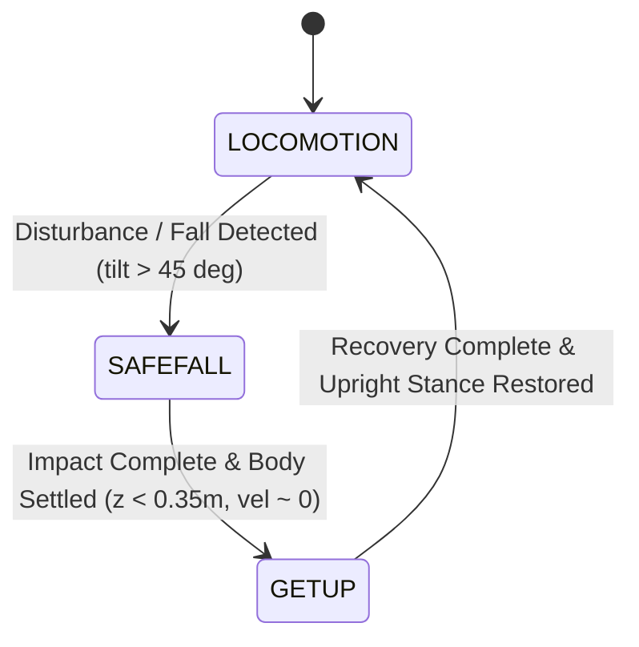

# VASIMOV Policy-Pluggable Architecture

## 1. Architectural Philosophy

> **VASIMOV is the robot and simulation platform. Policies are interchangeable controllers operating on top of that platform.**

The core simulation, robot model, actuator layer, telemetry, sensor stack, and safety subsystems are strictly decoupled from any specific policy tensor representation.

```text
                 ┌─────────────────────────┐
                 │       ASIMOV 1          │
                 │    MuJoCo Simulation    │
                 └────────────┬────────────┘
                              │
                       Canonical State (RobotState)
                              │
                 ┌────────────▼────────────┐
                 │     Policy System       │
                 │                         │
                 │  locomotion             │
                 │  balance                │
                 │  recovery (getup/fall)  │
                 │  custom controllers     │
                 └────────────┬────────────┘
                              │
                       Unified Command (UnifiedRobotCommand)
                              │
                       Safety Layer (Hard Limits, NaN/Inf Trap)
                              │
                       Actuator Interface (PD & Ankles)
                              │
                         MuJoCo Motors
```

---

## 2. Core Subsystems & Components

### 2.1 Canonical Robot State (`edge/robot_state.py`)
`RobotState` provides a standardized, physical snapshot of the robot at each simulation cycle (200 Hz).
It exposes only legitimate, physically grounded measurements:
- **Base Kinematics**: pelvis position, orientation quaternion, rotation matrix (world & body frames).
- **Base Dynamics**: linear and angular velocities in world and body frames.
- **Projected Gravity**: unit vector $[g_x, g_y, g_z]$ expressing gravity in the body frame.
- **Joint States**: positions (rad), velocities (rad/s), and accelerations for all degrees of freedom.
- **Actuator Feedback**: applied motor torques ($N\cdot m$), actuator controls, temperature ($^\circ C$).
- **Contacts**: left and right foot contact flags and ground reaction forces ($N$).
- **High-Level Directives**: commanded planar velocities $(v_x, v_y, \omega_z)$, system mode (`STAND`, `MOVE`, `DAMP`), and gantry status.

Policies never access MuJoCo's raw `mjData` directly. All observations are built strictly from `RobotState`.

### 2.2 Unified Robot Command (`edge/robot_command.py`)
`UnifiedRobotCommand` is the canonical output structure generated by policies:
- `joint_targets`: dictionary of desired joint angles ($\text{rad}$).
- `kp`, `kd`: stiffness and damping gains per joint.
- `effort_limits`: maximum motor torque limit per joint ($N\cdot m$).
- `feedforward_torques`: feedforward torque injection ($N\cdot m$).
- `mode`: operation mode (`MOVE`, `DAMP`, `HOLD`).
- `policy_name`: originating policy identifier.

### 2.3 Policy Contract & Manifest (`edge/policy_contract.py`)
Every policy is self-describing through a declarative YAML `manifest.yaml` specifying:
- **Identity**: name, version, category (`locomotion`, `recovery`, `balance`, `manipulation`).
- **Runtime**: engine type (`onnx`, `torchscript`, `python`), model path, execution options.
- **Control Frequency**: policy update rate in Hz (e.g., 50 Hz = 4 MuJoCo physics steps per control step).
- **Observation Spec**: dimension, datatype, history length, normalization factors, and required sensory signals.
- **Action Spec**: dimension, datatype, action type (`joint_position`, `joint_delta`, `torque`), joint order, and default targets.

### 2.4 Policy Runtime Abstraction (`edge/policy_runtime.py`)
Decouples inference engines from the simulator:
- `BasePolicyRuntime`: abstract runtime interface (`run()`, `reset()`, `input_shapes`, `output_shapes`).
- `ONNXPolicyRuntime`: production ONNX Runtime execution engine with automatic session options and thread pacing.

### 2.5 Policy Adapters (`edge/policy_adapter.py`)
Bridges the canonical `RobotState` to the policy-specific observation tensor, and translates raw policy outputs into `UnifiedRobotCommand`:
- `OfficialLocomotionAdapter`: 78-D observation tensor for Menlo Asimov 1 locomotion policy:
  $[ \omega_{\text{body}} (3), g_{\text{proj}} (3), v_{\text{cmd}} (3), q_{\text{pos}} (23), \dot{q}_{\text{vel}} (23), a_{\text{prev}} (23) ]$.
- `GetupSafefallAdapter`: 375-D stacked 5-step observation tensor for OpenHorizon Labs recovery policies:
  $[ \omega_{\text{body}} \times 0.25 (3), g_{\text{proj}} (3), q_{\text{pos}} (23), \dot{q}_{\text{vel}} \times 0.1 (23), a_{\text{prev}} (23) ] \times 5\text{ steps}$.

### 2.6 Safety & Guardrail Layer (`edge/safety.py`)
The safety layer sits **between** policy actions and the robot actuators. Policies can never bypass safety:
1. **NaN / Inf Trap**: Any non-finite value immediately triggers a safety shutdown into compliant `DAMP` mode.
2. **Range Clamping**: Joint targets are strictly clamped to mechanical hard stops.
3. **Rate Limiting**: Slew-rate limiter prevents instantaneous step discontinuities.
4. **Effort Clamping**: Commanded torques cannot exceed physical motor limits.

### 2.7 Policy Manager & Registry (`edge/policy_registry.py`, `edge/policy_manager.py`)
- **Discovery**: Automatically scans the `policies/` directory tree for valid manifests (`manifest.yaml`).
- **Validation**: Verifies tensor dimensions, ONNX input/output signatures, and joint kinematics against the MuJoCo model.
- **Arbitration**: Guarantees deterministic ownership. Policies never simultaneously write to actuators. Supports both single-policy execution (`ArbitrationMode.SINGLE`) and high-level behavioral composition (`ArbitrationMode.AUTO_COMPOSE`).

---

## 3. Policy Execution Lifecycle

```text
MuJoCo Physics Step (200 Hz, dt=0.005s)
  │
  ├─> Read sensors & compute kinematics
  ├─> Build canonical RobotState
  │
  ▼
Decimation Check (e.g., 50 Hz policy period = every 4 physics steps)
  ├─> [Not due] Apply cached safe command to PD actuators
  └─> [Due] Policy Execution:
        │
        ├─ 1. PolicyAdapter.build_observation(RobotState) -> Tensor
        ├─ 2. PolicyRuntime.run(Tensor) -> Raw Actions
        ├─ 3. PolicyAdapter.process_action(Raw Actions) -> UnifiedRobotCommand
        ├─ 4. SafetyLayer.filter_command(Command) -> Safe UnifiedRobotCommand
        └─ 5. Cache Safe Command & apply to Actuator Interface
```

---

## 4. Multi-Policy Composition & State Machine

When configured in composition mode (`--locomotion <pol> --recovery <pol>`), `PolicyManager` arbitrates policy ownership based on physical robot states:



In all transitions:
- Latched fault transitions prevent erratic switching.
- Commands are rate-limited and filtered by the Safety Layer.
- Actuators receive unified, non-conflicting targets.
